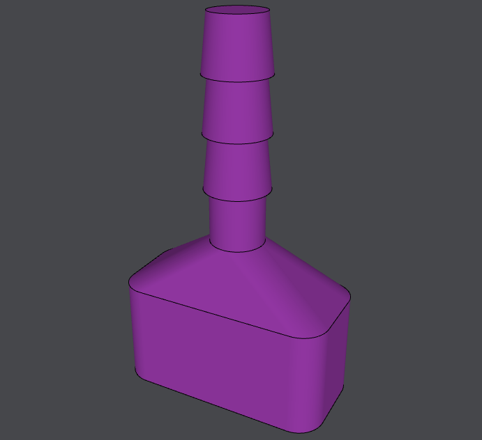

# OCADml

OCADml is a collection of types and functions built on top of
[Gg](https://erratique.ch/software/gg) facilitating Computer Aided
Design (CAD) in OCaml. In particular, the style of design currently supported is
that of 2D drawing and mesh generation via sweeping/extrusion.

## Usage

``` ocaml
  open OCADml

  let () =
    let fn = 128 in
    let base =
      let sq = Path3.square ~center:true (v2 2. 4.) in
      Path3.(roundover ~fn (Round.flat ~corner:(Round.circ (`Radius 0.5)) sq))
    and c r h = Path3.ztrans h @@ Path3.circle ~fn r in
    let cones = List.map (fun h -> [ c 0.6 h; c 0.5 (h +. 1.) ]) [ 4.; 5.; 6. ] in
    List.flatten ([ base; Path3.ztrans 2. base; c 0.5 3.; c 0.5 4. ] :: cones)
    |> Mesh.skin ~slices:(`Flat 0)
    |> Mesh.to_stl "vacuum_connector.stl"
```



## Documentation

Documentation is available
[online](https://ocadml.github.io/OCADml/OCADml/index.html), covering the
[API](https://ocadml.github.io/OCADml/OCADml/index.html#api). As this library
is not associated with any CAD backend, it is a bit dry on it's own and replete
of examples. To get a better idea of what can be done with the tools provided it
may be helpful to check out a library utilizing them.

## CAD Package Specific Frontends

This library only provides a means to generate point and face based geometries,
in order to perform boolean operations and validation of properties such as
manifoldness you'll need to work with a particular CAD package.

### OSCADml
- [github](https://github.com/OCADml/OSCADml)
- [docs](https://ocadml.github.io/OSCADml/OSCADml/index.html)
- [examples](https://ocadml.github.io/OSCADml/OSCADml/index.html#examples)

### OManifold
- [github](https://github.com/OCADml/OManifold)
- [docs](https://ocadml.github.io/OManifold/OManifold/index.html)

## Companion PPX

There is a companion ppx, [\[@@deriving
cad\]](https://github.com/OCADml/ppx_deriving_cad) for generating
transformation functions for user-defined records and abstract types made up of
CAD specific types such as [OSCADml](https://github.com/OSCADml)'s `Scad.t`,
along with their corresponding vector (`V2.t` or `V3.t`) types (and those
composed of them) provided in this library.

## Inspiration

This effort began as an extension of the
[Scad_ml](https://github.com/namachan10777/scad-ml) OpenSCAD DSL, but grew to
the point where it seemed prudent to break out into a "backend" agnostic format
so as to be more generally useful.

Module organization and implementations borrow heavily
from existing libraries in the OpenSCAD community:
- [BOSL2](https://github.com/revarbat/BOSL2)
- [dotSCAD](https://github.com/JustinSDK/dotSCAD/tree/master/src)
- [PlotFunction](https://github.com/rcolyer/plot-function)
